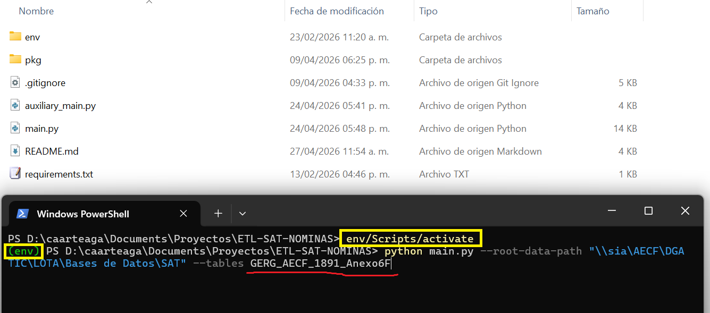
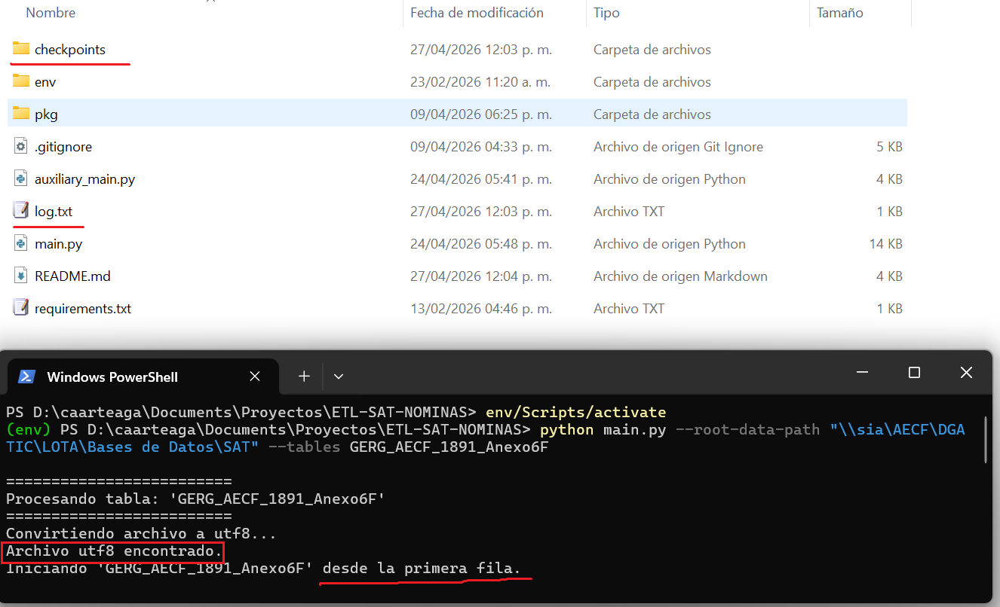
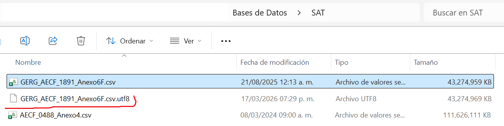
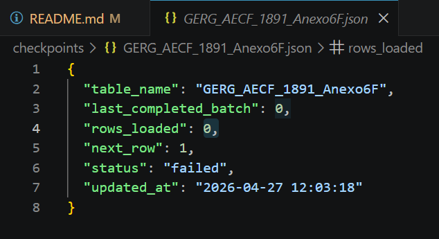
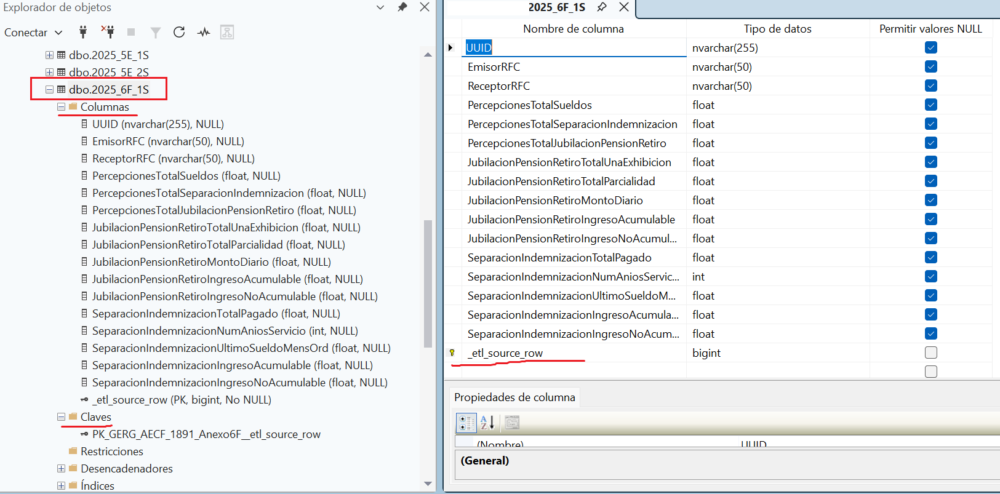
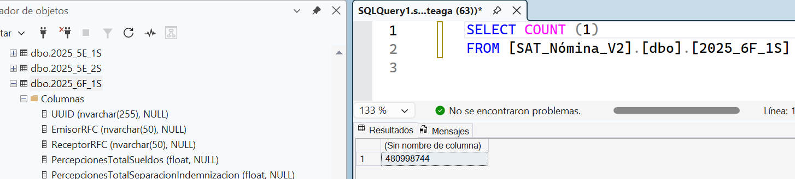

# ETL-SAT-NOMINAS
Full ETL process using Polars and SQL Server. All DataFrames (tables) are obtain from csv files, 
all secret data connection should be contained in '.env' file (not provided). Before extraction process, the file is converted to utf8 encoding in the same source file path.

## 🌎 Repository Structure
```
ETL-SAT-NOMINAS/
├── main.py
├── auxiliary_main.py   # The simplest ETL script implementing processing by batches
├── .gitignore
├── env/                # Virtual enviroment (not provided)
└── requirements.txt
└── pkg                 # Contains all needed files (Python package)
    └── __init__.py     # Specifies that folder 'pkg' is a Python package
    └── extract.py      # Contains all functions related to extraction process
    └── transform.py    # Contains all functions related to transform process
    └── globals.py      # Contains all global variables
    └── config.py       # Contains all configuration params
    └── .env            # Contains all secret data (not provided)
```

## ✨ Details
**main.py:** This script calls 'extract.py' to obtain the DataFrames corresponding to the tables, then 'transform.py' script is called to clean data, to convert the columns into the correct format and to load to SQL Server. The complete process is performed by batches (chunks) by implementing the Polars function **read_csv_batched**. The corresponding table is created by using SQL commands before loading data. It has the following features:
- Automatic resumption with JSON checkpoints ('checkpoints' folder is created to save the JSON file with the corresponding information to restart the process for each table).
- Manual resumption from a row using `--resume-row`.
- Graceful pause by creating the `pause.flag` file.
- Idempotent row loading by adding the `_etl_source_row` technical column.
- Before resuming, deletes from that row forward to avoid duplicates.

**auxiliary_main.py:** Performences the ETL process of 'main.py', but restart is not possible. It is also possible to save the processed data into a CSV file with the 'save_batch_to_csv' function.

## 🚀 How to run locally
1. Clone this repository:
```
git clone https://github.com/departamentoIA/ETL-SAT-NOMINAS.git
```
2. Set virtual environment and install dependencies.

For Windows:
```
python -m venv env
env/Scripts/activate
pip install -r requirements.txt
```
For Linux:
```
python -m venv env && source env/bin/activate && pip install -r requirements.txt
```
3. Create your ".env" file, which has the following form:
```
DB_SERVER=10.0.00.00,5000
DB_NAME=SAT
DB_USER=caarteaga
DB_PASSWORD=pa$$word
```
4. Run "main.py", source file path is specified in the input argument '--root-data-path' and the table names are specified in the input argument '--tables':
```
python main.py --root-data-path "\\sia\AECF\DGATIC\LOTA\Bases de Datos\SAT" --tables table1 table2
```
To run specific tables and conditions:
```
python main.py ^
  --root-data-path "\\sia\AECF\DGATIC\LOTA\Bases de Datos\SAT" ^
  --tables table1 table2 ^
  --resume-table table1 ^
  --resume-row 1001
```

## 🎯 Results
After running main (see Fig. 1), the folder 'checkpoints' and the log file 'log.txt' are created, as shown in Fig. 2. Besides, in this case, the file was already converted to utf8 encoding, as shown in Fig. 3, then the table is loaded to SQL Server from the beginning.

Fig. 1.


Fig. 2.


Fig. 3.

In the folder 'checkpoints' is the corresponding JSON file, which contains the information necessary to restart the table loading, as shown in Fig. 4.


Fig. 4.

Once the table is completely loaded, the JSON file is removed automatically. The table was renamed to '2025_6F_1S', the design of this table is presented in Fig. 5, which contains 480,998,744 rows, as shown in Fig. 6.

Fig. 5.


Fig. 6.